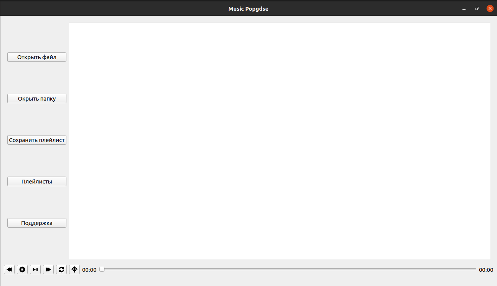
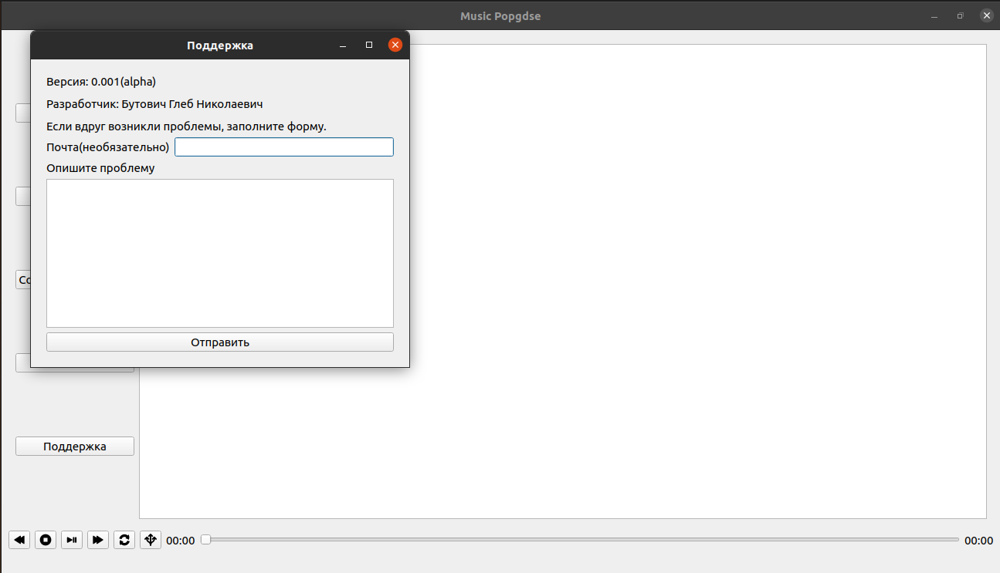

# Руководство по установке.
1. Установите Python. Если у вас стоит Windows, то вот руководство по установке: [руководство](https://tutorial.djangogirls.org/ru/python_installation/). А если у вас Linux, то достаточно ввести эту команду в терминале: ```sudo apt install python3```
2. Скопируйте репозиторий себе на компьютер с помощью команды ```git clone [репозиторий]``` Как установить git, [здесь](https://git-scm.com/book/ru/v2/%D0%92%D0%B2%D0%B5%D0%B4%D0%B5%D0%BD%D0%B8%D0%B5-%D0%A3%D1%81%D1%82%D0%B0%D0%BD%D0%BE%D0%B2%D0%BA%D0%B0-Git).
3. Установите все нужные библиотеки. Для начала зайдите в папку, которая у вас появилась, и напишите команду в терминале, запустив при этом его в папке: ```pip install -r requirements.txt```
На этом все. Запустите программу: ```python3 main.py```
## Краткий обзор


1. Открыть файл: открыть файл в проигрывателе.
2. Открыть плейлист: открыть папку с файлами(откроются только файлы формата mp3, даже если там есть файлы других форматов)
3. Сохранить плейлист: предпологает сохранять папки в программе, не окрывая папку снова и снова, нажимая на "Открыть плейлист". (В разработке)
4. Плейлисты: предмолагает возможность запускать сохраненные папки с музыкой(плейлисты) в программе. (В разработке)
5. Поддержка: по всем проблемам и вопросам туда
На самом деле проекту надо пройти еще много каких модорнезаций, и так далее. Так что проект очень сырой. Но я работаю над ним, так что...
На этом все. Хорошего пользования!
V 0.001-beta
